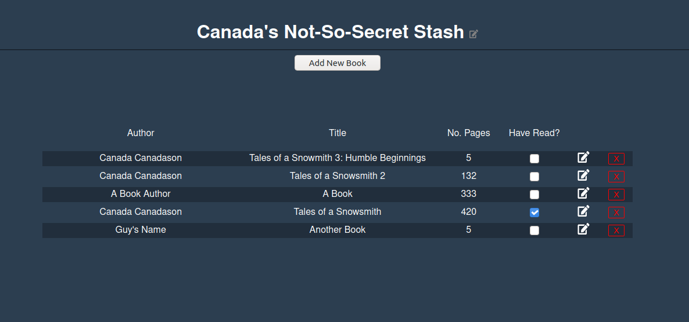

## Library using Vuejs

This project is a refactor of [this previous Library project](https://github.com/ellielle/library)
from [The Odin Project](https://www.theodinproject.com/courses/javascript/lessons/frameworks).

A live version of this site can be found [here](https://ellielle.github.io/library-vue/).

This is my first real attempt at a single page site, and although it took a bit longer than I thought to work on it, it
has been a pretty great learning experience.

 
#### Preview

Click to view preview image!

 
#### Issues
* A grid is created for each book, instead of the list as a whole. I looked into using slots, and a few other ways to fix
this issue, but all of them created the same output ¯\\_(ツ)_/¯
* The design could be a little more exciting. I'm still mostly a beginner with CSS as of this project and hope to come
back and jazz it up some later.
